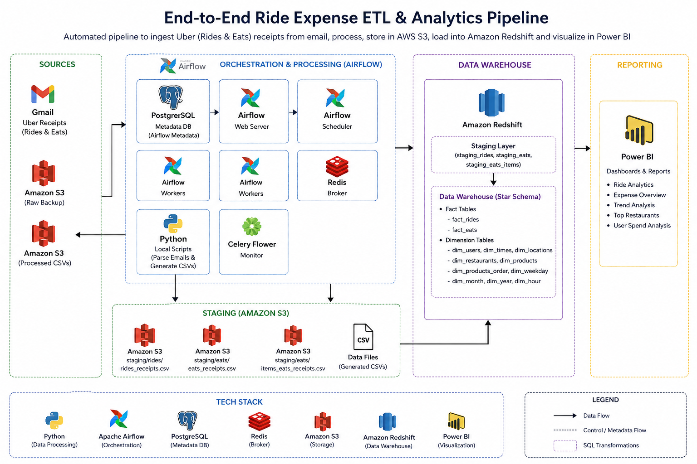
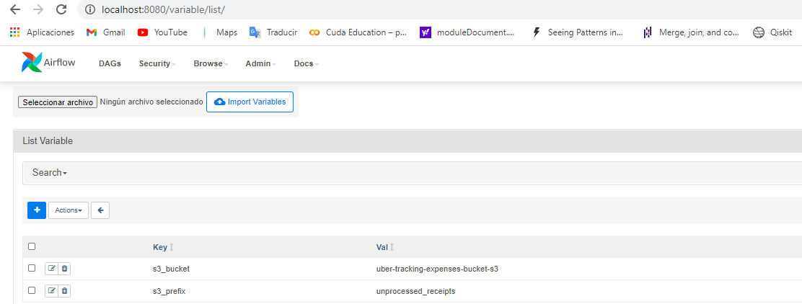
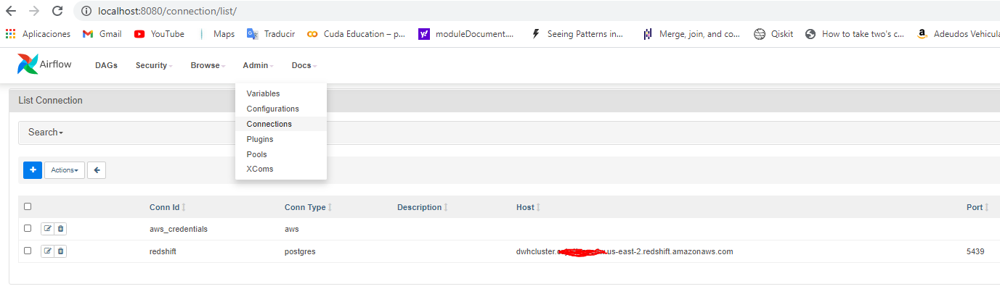

# 🚖 End-to-End Uber Ride & Eats Expense ETL Analytics Pipeline using Apache Airflow, Amazon S3, Amazon Redshift & Power BI


---

## Project Overview

Managing transportation and food delivery expenses can quickly become difficult without a centralized view of spending. This project builds an end-to-end Data Engineering pipeline that automates the collection, transformation, storage, and visualization of **Uber Rides** and **Uber Eats** expense data, enabling users to monitor spending patterns and generate actionable insights.

The pipeline extracts receipt data, performs data cleansing and transformation, orchestrates workflows using **Apache Airflow**, loads curated datasets into **Amazon Redshift**, and presents interactive dashboards in **Power BI** for expense analysis. The solution follows modern ETL best practices, providing a scalable and automated analytics workflow suitable for real-world Data Engineering scenarios.

---

# Architecture - Uber Expenses Tracking

<p align="center">
    
</p>

---

# The Final Schema We Are Going to Build

<p align="center">
    
</p>

---

# The Final DAG We Are Going to Build

<p align="center">
    
</p>

---

# What are the Data Sources?

Every time an **Uber Eats** order is delivered or an **Uber Ride** is completed, Uber sends a confirmation email containing a detailed payment receipt.

These receipts are attached as **`.eml` (email message)** files and include valuable information such as:

- Trip or Order Details
- Pickup and Drop Locations
- Restaurant Information
- Transaction Amounts
- Taxes
- Discounts
- Timestamps
- Payment Information
- Item-level Purchase Details (Uber Eats)

In this project, these `.eml` receipt files serve as the **primary raw data source** for the ETL pipeline.

The raw receipt files are stored locally and later uploaded to **Amazon S3**, where they become the ingestion source for the Apache Airflow ETL workflow.

---

# AWS Infrastructure Provisioning & Environment Setup

This section covers the provisioning of the AWS infrastructure required for the project, including the creation and configuration of the **Amazon Redshift Cluster**, **IAM Resources**, **Amazon EC2 Instance**, and **Amazon S3 Staging Bucket**.

The notebook

```
AWS_IAC_IAM_EC2_S3_Redshift.ipynb
```

automates the entire cloud infrastructure setup required before executing the Airflow ETL pipeline.

---

## Steps

### 1. Install Git

Install Git on your local machine.

> **Recommended:** Git Bash for Windows.

---

### 2. Clone the Repository

```bash
git clone https://github.com/vinaykandimalla01/End-to-End-Ride-Expense-ETL-Analytics-Pipeline.git
```

---

### 3. Navigate to the Repository

```bash
cd End-to-End-Ride-Expense-ETL-Analytics-Pipeline
```

---

### 4. Create an AWS IAM User

Create an IAM User with

- AdministratorAccess

(or the required permissions for this project).

Generate

- Access Key ID
- Secret Access Key

---

### 5. Configure AWS CLI

Install AWS CLI.

Run

```bash
aws configure
```

Enter

```
AWS Access Key ID
AWS Secret Access Key
Default Region
Output Format
```

---

### 6. Open the Project in VS Code

Install

- Python Extension
- Jupyter Extension

from the VS Code Marketplace.

Select the project's Python Interpreter or Virtual Environment.

---

### 7. Open the Infrastructure Notebook

```
AWS_IAC_IAM_EC2_S3_Redshift.ipynb
```

Select the proper Python Kernel.

Execute the notebook **from top to bottom**.

The notebook automatically provisions

- IAM Resources
- Amazon S3 Buckets
- Amazon EC2 Instance
- Amazon Redshift Cluster

Once execution finishes successfully, verify that the resources were created in the AWS Console.

Your cloud environment is now ready for deploying the Apache Airflow ETL pipeline.

---

# AWS Infrastructure Notebook

The following sections walk through the notebook used to provision the AWS infrastructure.

---

# Load Configuration Parameters

The notebook loads all required AWS and Amazon Redshift configuration values from the project environment. These parameters are later used to provision the cloud infrastructure automatically.

```python
from dotenv import load_dotenv
import os
import configparser
import pandas as pd

load_dotenv(override=True)

config = configparser.ConfigParser()

config["AWS"] = {
    "KEY": os.getenv("KEY"),
    "SECRET": os.getenv("SECRET")
}

config["DWH"] = {
    "DWH_CLUSTER_TYPE": os.getenv("DWH_CLUSTER_TYPE"),
    "DWH_NUM_NODES": os.getenv("DWH_NUM_NODES"),
    "DWH_NODE_TYPE": os.getenv("DWH_NODE_TYPE"),
    ...
}
```

This step retrieves all required configuration values, including:

- AWS Access Key
- AWS Secret Key
- Redshift Cluster Type
- Node Type
- Cluster Identifier
- Database Name
- Database User
- Database Password
- IAM Role Name
- Database Port

These values are later consumed while provisioning AWS resources.

---

# Create AWS Clients

The notebook creates authenticated clients for the AWS services required throughout the project.

```python
ec2 = boto3.resource(
    "ec2",
    region_name="us-east-2",
    aws_access_key_id=KEY,
    aws_secret_access_key=SECRET
)

iam = boto3.client(
    "iam",
    aws_access_key_id=KEY,
    aws_secret_access_key=SECRET,
    region_name="us-east-2"
)

redshift = boto3.client(
    "redshift",
    aws_access_key_id=KEY,
    aws_secret_access_key=SECRET,
    region_name="us-east-2"
)
```

The notebook creates clients for:

- Amazon EC2
- AWS IAM
- Amazon Redshift

These clients are used throughout the remaining notebook.

---

# Create IAM Role

Amazon Redshift requires an IAM Role in order to read files stored inside Amazon S3.

The notebook automatically creates the IAM role and attaches the required Amazon S3 read permissions.

```python
try:

    print("Creating new IAM Role")

    dwhRole = iam.create_role(
        Path="/",
        RoleName=DWH_IAM_ROLE_NAME,
        Description="Allows Redshift clusters to call AWS services on your behalf.",
        AssumeRolePolicyDocument=...
    )

except Exception as e:
    print(e)
```

The notebook then attaches the following AWS managed policy:

```
AmazonS3ReadOnlyAccess
```

After the policy has been attached successfully, the notebook retrieves the generated IAM Role ARN.

---

# Create Amazon Redshift Cluster

Once the IAM Role has been created, the notebook provisions a new Amazon Redshift Cluster.

```python
response = redshift.create_cluster(

    ClusterType=DWH_CLUSTER_TYPE,

    NodeType=DWH_NODE_TYPE,

    NumberOfNodes=int(DWH_NUM_NODES),

    DBName=DWH_DB,

    ClusterIdentifier=DWH_CLUSTER_IDENTIFIER,

    MasterUsername=DWH_DB_USER,

    MasterUserPassword=DWH_DB_PASSWORD,

    IamRoles=[roleArn]

)
```

This automatically creates:

- Amazon Redshift Cluster
- Database
- Master User
- Attached IAM Role

---

# Verify Cluster Creation

Provisioning a Redshift cluster usually takes several minutes.

The following helper function is repeatedly executed until the cluster status becomes:

```
Available
```

```python
def prettyRedshiftProps(props):

    pd.set_option("display.max_colwidth", None)

    ...

myClusterProps = redshift.describe_clusters(
    ClusterIdentifier=DWH_CLUSTER_IDENTIFIER
)["Clusters"][0]
```

The notebook displays useful information including:

- Cluster Identifier
- Cluster Status
- Endpoint
- Node Type
- Number of Nodes
- Database Name
- Master Username
- VPC ID

---

# Retrieve Cluster Endpoint

After the cluster becomes available, the notebook retrieves the Redshift Endpoint and IAM Role ARN.

```python
DWH_ENDPOINT = myClusterProps["Endpoint"]["Address"]

DWH_ROLE_ARN = myClusterProps["IamRoles"][0]["IamRoleArn"]

print(DWH_ENDPOINT)

print(DWH_ROLE_ARN)
```

These values are required later by Apache Airflow and Power BI.

---

# Configure Security Group

To allow external connections to Amazon Redshift, the notebook opens the configured database port inside the default VPC Security Group.

```python
vpc = ec2.Vpc(id=myClusterProps["VpcId"])

defaultSg = list(vpc.security_groups.all())[0]

defaultSg.authorize_ingress(

    GroupName=defaultSg.group_name,

    CidrIp="0.0.0.0/0",

    IpProtocol="TCP",

    FromPort=int(DWH_PORT),

    ToPort=int(DWH_PORT)

)
```

This enables external applications such as:

- Apache Airflow
- Power BI Desktop
- SQL Clients

to communicate with the Redshift cluster.

---

# Validate the Amazon Redshift Connection

The notebook builds the PostgreSQL connection string.

```python
conn_string = "postgresql://{}:{}@{}:{}/{}".format(

    DWH_DB_USER,

    DWH_DB_PASSWORD,

    DWH_ENDPOINT,

    DWH_PORT,

    DWH_DB

)

print(conn_string)
```

Then verifies the connection.

```python
print("Connecting to Redshift")

conn = psycopg2.connect(conn_string)

print("Connected Successfully")
```

A successful connection confirms that the infrastructure has been provisioned correctly.

---

# Infrastructure Cleanup

The notebook also includes optional cleanup commands.

These commands are commented out intentionally and should only be executed when you want to remove the AWS resources.

The cleanup section deletes:

- Amazon Redshift Cluster
- IAM Policy
- IAM Role

```python
# redshift.delete_cluster(...)

# iam.detach_role_policy(...)

# iam.delete_role(...)
```

> **Note:** Do not execute the cleanup section until you have completed all ETL experiments.

---

# Deploying the ETL Pipeline with Apache Airflow

This project leverages **Docker** and **Docker Compose** to deploy a complete Apache Airflow environment.

Docker Compose orchestrates multiple services required by Airflow, including:

- PostgreSQL Metadata Database
- Airflow Scheduler
- Airflow Webserver
- Celery Workers
- Redis Broker
- Flower Monitoring Service

This provides a reproducible and streamlined development environment.

---

# Docker Environment Setup

Follow the steps below to start the Airflow environment.

### Install Docker Desktop

Install Docker Desktop on Windows.

Docker Compose is included by default.

---

### Clone the Repository

```bash
git clone https://github.com/vinaykandimalla01/End-to-End-Ride-Expense-ETL-Analytics-Pipeline.git
```

---

### Navigate to the Repository

```bash
cd End-to-End-Ride-Expense-ETL-Analytics-Pipeline
```

---

### Move into the Source Directory

```bash
cd code
```

---

### Build Docker Images

```bash
docker compose build
```

---

### Initialize Airflow Metadata Database

```bash
docker compose up airflow-init
```

---

### Start All Airflow Services

```bash
docker compose up -d
```

---

### Verify Running Containers

```bash
docker ps
```

---

### Launch the Airflow Web Interface

Once all Docker containers are running successfully, open your browser and navigate to:

```text
http://localhost:8080
```

Log in using:

```text
Username : airflow
Password : airflow
```

> If you have customized the credentials inside `docker-compose.yaml`, use your updated credentials instead.

---

# Configure Airflow Variables

Before running the DAG, configure the required Airflow Variables.

1. Open Airflow Web UI.

2. Navigate to

```
Admin → Variables
```

3. Click

```
+ Add Variable
```

4. Add all required project variables.

5. Save the variables.

After completing this step, the ETL pipeline is ready for execution.

<p align="center">

</p>

---

# Configure Airflow Connections

Now navigate to

```
Admin → Connections
```

Configure the required connections for:

- AWS Credentials
- Amazon Redshift

<p align="center">

</p>

---

# Running the Airflow DAG

Once the Airflow environment has been successfully deployed and configured, you can execute the ETL pipeline using either the command line or the Airflow Web UI.

---

## Method 1: Trigger the DAG from the Terminal

Open a new terminal (Git Bash, PowerShell, or Command Prompt).

Verify that all Docker containers are running:

```bash
docker ps
```

Identify the **Airflow Scheduler** container from the running containers.

Trigger the DAG:

```bash
docker exec <scheduler_container_name> airflow dags trigger Uber_tracking_expenses
```

### Example

```bash
docker exec airflow-scheduler airflow dags trigger Uber_tracking_expenses
```

> **Note**
>
> Replace `<scheduler_container_name>` with the actual name of your Airflow Scheduler container if it differs.

---

## Method 2: Trigger the DAG from the Airflow Web UI (Recommended)

1. Open the Airflow Web UI

```
http://localhost:8080
```

2. Login using your Airflow credentials.

3. Navigate to **DAGs**.

4. Locate

```
Uber_tracking_expenses
```

5. Enable the DAG if it is paused.

6. Click **▶ Trigger DAG**.

7. Monitor execution using:

- Graph View
- Grid View
- Task Logs

> **Recommendation**
>
> Triggering the DAG through the Airflow UI provides better visibility into task execution, logs, retries, and overall pipeline monitoring.

---

# DAG Workflow Overview

The Airflow DAG orchestrates the complete ETL pipeline, transforming raw Uber receipt emails into a dimensional data warehouse hosted in Amazon Redshift.

The workflow has been designed to execute dependent tasks in the correct order while maximizing efficiency through parallel task execution.

---

## 1. Receipt Classification

The pipeline begins with the **Start_UBER_Business** task.

This task scans the raw `.eml` receipt files stored inside the Amazon S3 landing bucket and separates them into two categories:

- Uber Rides
- Uber Eats

Both datasets are then processed simultaneously using parallel Airflow tasks.

This parallel execution significantly reduces the total pipeline execution time.

---

## 2. Receipt Processing

The following Airflow tasks process the receipt emails:

- rides_receipts_to_s3_task
- eats_receipts_to_s3_task

Each task:

- Parses the email
- Extracts transaction information
- Cleans the data
- Generates structured CSV files

Generated datasets include:

- rides_receipts.csv
- eats_receipts.csv
- items_eats_receipts.csv

These files are uploaded to Amazon S3 and become the source for the warehouse loading phase.

---

## 3. Data Warehouse Initialization

Once receipt processing finishes successfully, the pipeline automatically creates all required Redshift objects.

These include:

- Staging Tables
- Dimension Tables
- Fact Tables

This guarantees that the warehouse schema exists before data loading begins.

---

## 4. Loading Staging Tables

The generated CSV files are loaded from Amazon S3 into Amazon Redshift using the high-performance COPY command.

The staging tables created are:

- staging_rides
- staging_eats
- staging_eats_items

The staging layer acts as an intermediate validation layer before loading the analytical warehouse.

---

## 5. Loading the Dimensional Data Warehouse

After staging tables have been populated, the warehouse loading process begins.

Loading order:

1. Dimension Tables
2. Fact Tables

Loading dimension tables first guarantees referential integrity for the fact tables.

All SQL transformations used during this phase are implemented inside:

```
sql_statements.py
```

---

## 6. Data Quality Validation

After loading the warehouse, the DAG executes several validation tasks.

Typical checks include:

- Verify tables are populated
- Validate row counts
- Detect loading failures
- Confirm warehouse integrity

These checks ensure that reporting data is accurate before it becomes available for analytics.

---

## 7. Pipeline Cleanup

As the final step, temporary staging tables are removed from Amazon Redshift.

Cleaning these intermediate objects keeps the warehouse organized while leaving only analytical tables available for reporting.

---

# ETL Workflow Summary

```text
Raw .eml Receipts (Amazon S3)
            │
            ▼
Receipt Classification
            │
      ┌─────┴─────┐
      ▼           ▼
 Uber Rides   Uber Eats
      │           │
      └─────┬─────┘
            ▼
Generate Processed CSV Files
            ▼
Upload to Amazon S3
            ▼
Create Redshift Tables
            ▼
Load Staging Tables (COPY)
            ▼
Load Dimension Tables
            ▼
Load Fact Tables
            ▼
Data Quality Checks
            ▼
Cleanup Staging Tables
```

The entire workflow transforms raw Uber receipt emails into a structured dimensional warehouse suitable for business intelligence and analytical reporting.

---

# Visualizing Data with Microsoft Power BI

Once the ETL pipeline successfully loads the processed data into Amazon Redshift, Microsoft Power BI Desktop can be connected to the warehouse for interactive reporting.

The repository includes a pre-built Power BI report:

```
report_receipts.pbix
```

which visualizes key metrics for both Uber Rides and Uber Eats.

---

# Connect Power BI to Amazon Redshift

Follow these steps to connect Power BI Desktop to Amazon Redshift.

1. Open **Microsoft Power BI Desktop**

2. Login to your Power BI account.

3. Navigate to

```
Home → Get Data → More...
```

4. Select

```
Database → Amazon Redshift Database
```

5. Click **Connect**

6. Enter:

- Server → Your Amazon Redshift Endpoint
- Database → Your Database Name
- Connectivity Mode → Import

<p align="center">

</p>

7. Authenticate using your Redshift credentials.

8. Select the required tables.

9. Load the dataset.

10. Open:

```
report_receipts.pbix
```

or create your own dashboards.

Refresh the dataset whenever new records are loaded into Amazon Redshift.

---

# Updating the Amazon Redshift Connection

If your Amazon Redshift cluster is recreated, its endpoint will change.

Update the Power BI connection by navigating to:

```
Home → Transform Data → Data Source Settings
```

Select the Amazon Redshift connection.

Click

```
Change Source...
```

Replace:

- Server
- Database

Refresh the report.

---

# Dashboard Highlights

The Power BI report provides interactive dashboards for:

## Uber Rides Analytics

- Total Rides
- Ride Expenses
- Monthly Spending
- Trip Locations
- Payment Methods
- Expense Trends

---

## Uber Eats Analytics

- Total Orders
- Food Expenses
- Restaurant-wise Spending
- Monthly Orders
- Item-wise Purchases
- Spending Trends

These dashboards provide an interactive way to analyze transportation and food delivery expenses using data stored in Amazon Redshift.

---


---

# Technologies Used

- Python
- Apache Airflow
- Docker
- Docker Compose
- Amazon S3
- Amazon Redshift
- AWS IAM
- Amazon EC2
- PostgreSQL
- Power BI
- Pandas
- Boto3
- SQL
- Git
- GitHub

---

# Key Features

- End-to-End ETL Pipeline
- Automated Receipt Processing
- Apache Airflow Workflow Orchestration
- Amazon S3 Data Lake
- Amazon Redshift Data Warehouse
- Dockerized Deployment
- Automated Infrastructure Provisioning
- Interactive Power BI Dashboards
- Data Quality Validation
- Dimensional Data Warehouse Design

---


# Authors

Created by

### **[Vinay Kandimalla](https://www.linkedin.com/in/vinay-kandimalla-52b16929b/)**

Created on **2026**

---

## ⭐ If you found this project useful, consider giving it a Star on GitHub!
